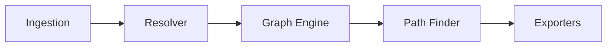

# Architecture

sxaiam is built around four independent modules that communicate through
well-defined interfaces. Each module can be used independently as a Python library.

## Overview



## Module: Ingestion (`sxaiam/ingestion/`)

**Responsibility:** collect raw IAM data from AWS via boto3.

The core call is `iam:GetAccountAuthorizationDetails`, which returns users, roles,
groups, and policies in a single API call. The ingestion module normalizes this
into an `IAMSnapshot` — a typed, immutable snapshot of the account's IAM state.

Key classes:
- `IngestionClient` — wraps boto3, calls AWS APIs
- `IAMSnapshot` — the normalized snapshot (users, roles, groups, policies)
- `IAMUser`, `IAMRole`, `IAMGroup`, `IAMPolicy` — typed models

**Design principle:** ingestion never makes decisions about permissions or risk.
It only collects and normalizes data.

---

## Module: Resolver (`sxaiam/resolver/`)

**Responsibility:** compute effective permissions per identity.

The resolver takes an `IAMSnapshot` and produces a `ResolvedIdentity` for each
user and role. A `ResolvedIdentity` answers the question: *what can this identity
actually do, given all its attached policies?*

Key classes:
- `PolicyResolver` — main engine, resolves all identities in a snapshot
- `ResolvedIdentity` — holds effective permissions, exposes `can(action, resource)`
- `Permission` — a single allowed action on a resource, with evidence

**Design principle:** the resolver is completely independent of the graph engine.
It never knows about attack paths or techniques.

---

## Module: Graph engine (`sxaiam/graph/`)

**Responsibility:** build the attack graph and find escalation paths.

The graph engine has two parts:

**Builder (`AttackGraph`)** — two-pass construction:
1. Pasada 1: create one node per identity (UserNode, RoleNode, GroupNode) plus a singleton AdminNode
2. Pasada 2: run ALL_TECHNIQUES against each identity, convert matches into directed edges

**PathFinder** — BFS from every non-admin node toward AdminNode, with a configurable
hop cutoff (default: 5). Returns `EscalationPath` objects with full evidence.

Key classes:
- `AttackGraph` — builds the networkx DiGraph
- `PathFinder` — BFS path finding
- `EscalationPath` — a complete path with techniques, evidence, and attack steps

**Design principle:** the graph engine never decides what is an escalation.
That decision belongs to the techniques in `sxaiam/findings/`.

---

## Module: Findings (`sxaiam/findings/`)

**Responsibility:** define what privilege escalation looks like.

Each technique is a class that inherits from `EscalationTechnique` and implements
`check(identity, snapshot) -> list[TechniqueMatch]`. The technique knows:

- What permissions it needs (`required_actions`)
- How to find viable targets in the snapshot
- What evidence to attach to each match

Adding a new technique requires no changes to any other module.

**Design principle:** escalation knowledge lives here, nowhere else.
The graph engine, resolver, and ingestion modules never contain technique-specific logic.

---

## Three architectural rules

These rules were established at the start of the project and are non-negotiable:

1. **Extensible node types** — the graph supports any node type, not just users and roles
2. **Complete separation** between the policy resolver and graph engine
3. **Escalation technique knowledge** stored in pluggable classes — never hardcoded logic

---

## Data flow example

```text
IngestionClient.collect()
→ IAMSnapshot(users=[...], roles=[...], policies=[...])

PolicyResolver(snapshot).resolve_all()
→ {arn: ResolvedIdentity, ...}

AttackGraph.build(snapshot, resolved_identities)
→ networkx.DiGraph with nodes and edges

PathFinder(graph).find_all_paths()
→ [EscalationPath, ...]

JsonExporter.export(paths)
→ findings.json
```